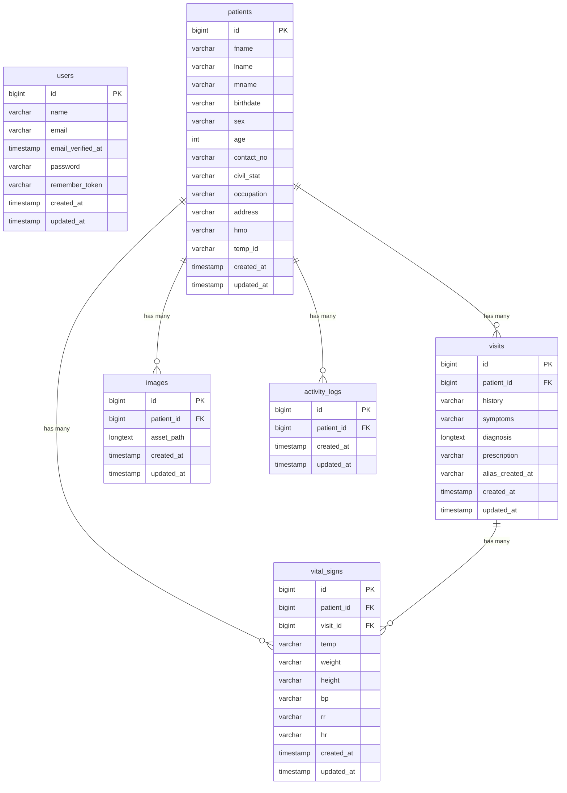

# Clinick2 — Database Schema & ERD

## Entity-Relationship Diagram

---

## Relationships Summary

| Parent Table | Child Table      | Relationship  | Foreign Key    | Description                                   |
|-------------|------------------|---------------|----------------|-----------------------------------------------|
| `patients`  | `visits`         | One-to-Many   | `patient_id`   | A patient can have many visits                |
| `patients`  | `images`         | One-to-Many   | `patient_id`   | A patient can have many images                |
| `patients`  | `vital_signs`    | One-to-Many   | `patient_id`   | A patient can have many vital sign records    |
| `patients`  | `activity_logs`  | One-to-Many   | `patient_id`   | A patient can have many activity log entries  |
| `visits`    | `vital_signs`    | One-to-Many   | `visit_id`     | A visit can have many vital sign recordings   |

> [!NOTE]
> The `users` table is independent — it stores system login credentials and is not directly related to the clinical data tables.

---

## Data Dictionary

### `users`

| Column              | Type              | Constraints           | Description                              |
|---------------------|-------------------|-----------------------|------------------------------------------|
| `id`                | `BIGINT UNSIGNED` | PK, Auto Increment    | Unique user identifier                   |
| `name`              | `VARCHAR(255)`    | NOT NULL              | User's full name                         |
| `email`             | `VARCHAR(255)`    | NOT NULL              | User's email address (used for login)    |
| `email_verified_at` | `TIMESTAMP`       | NULLABLE              | When the email was verified              |
| `password`          | `VARCHAR(255)`    | NOT NULL              | Bcrypt-hashed password                   |
| `remember_token`    | `VARCHAR(100)`    | NULLABLE              | Token for "remember me" sessions         |
| `created_at`        | `TIMESTAMP`       | NULLABLE              | Record creation timestamp                |
| `updated_at`        | `TIMESTAMP`       | NULLABLE              | Record last update timestamp             |

### `patients`

| Column       | Type              | Constraints                  | Description                           |
|-------------|-------------------|------------------------------|---------------------------------------|
| `id`        | `BIGINT UNSIGNED` | PK, Auto Increment           | Unique patient identifier             |
| `fname`     | `VARCHAR(100)`    | NOT NULL                     | First name                            |
| `lname`     | `VARCHAR(100)`    | NOT NULL                     | Last name                             |
| `mname`     | `VARCHAR(100)`    | NULLABLE                     | Middle name                           |
| `birthdate` | `VARCHAR(255)`    | NULLABLE                     | Date of birth (stored as string)      |
| `sex`       | `VARCHAR(2)`      | NOT NULL, DEFAULT `'NA'`     | Sex (`M`, `F`, or `NA`)              |
| `age`       | `INT`             | NULLABLE                     | Age of the patient                    |
| `contact_no`| `VARCHAR(15)`     | NULLABLE                     | Contact/phone number                  |
| `civil_stat`| `VARCHAR(100)`    | NULLABLE                     | Civil status (e.g. Single, Married)   |
| `occupation`| `VARCHAR(100)`    | NULLABLE                     | Patient's occupation                  |
| `address`   | `VARCHAR(255)`    | NULLABLE                     | Home address                          |
| `hmo`       | `VARCHAR(100)`    | NULLABLE                     | HMO / Health insurance provider       |
| `temp_id`   | `VARCHAR(100)`    | NULLABLE                     | Temporary/external ID reference       |
| `created_at`| `TIMESTAMP`       | NULLABLE                     | Record creation timestamp             |
| `updated_at`| `TIMESTAMP`       | NULLABLE                     | Record last update timestamp          |

### `visits`

| Column            | Type              | Constraints                      | Description                                    |
|-------------------|-------------------|----------------------------------|------------------------------------------------|
| `id`              | `BIGINT UNSIGNED` | PK, Auto Increment               | Unique visit identifier                        |
| `patient_id`      | `BIGINT UNSIGNED` | NOT NULL, FK → `patients.id`     | Reference to the patient                       |
| `history`         | `VARCHAR(255)`    | NULLABLE                         | Patient history notes                          |
| `symptoms`        | `VARCHAR(255)`    | NULLABLE                         | Reported symptoms                              |
| `diagnosis`       | `LONGTEXT`        | NULLABLE                         | Doctor's diagnosis (supports long text)        |
| `prescription`    | `VARCHAR(255)`    | NULLABLE                         | Prescribed medication/treatment                |
| `alias_created_at`| `VARCHAR(255)`    | NULLABLE                         | Alternate/display date for the visit           |
| `created_at`      | `TIMESTAMP`       | NULLABLE                         | Record creation timestamp                      |
| `updated_at`      | `TIMESTAMP`       | NULLABLE                         | Record last update timestamp                   |

### `images`

| Column       | Type              | Constraints                      | Description                                         |
|-------------|-------------------|----------------------------------|-----------------------------------------------------|
| `id`        | `BIGINT UNSIGNED` | PK, Auto Increment               | Unique image identifier                             |
| `patient_id`| `BIGINT UNSIGNED` | NOT NULL, FK → `patients.id`     | Reference to the patient                            |
| `asset_path`| `LONGTEXT`        | NOT NULL                         | File path or base64-encoded image data              |
| `created_at`| `TIMESTAMP`       | NULLABLE                         | Record creation timestamp                           |
| `updated_at`| `TIMESTAMP`       | NULLABLE                         | Record last update timestamp                        |

> [!NOTE]
> The `asset_path` column was originally `VARCHAR(255)` and was altered to `LONGTEXT` in migration `2021_07_24_225228_alter_images` to support larger data storage (e.g., base64-encoded images or long S3/MinIO paths).

### `vital_signs`

| Column       | Type              | Constraints                      | Description                       |
|-------------|-------------------|----------------------------------|-----------------------------------|
| `id`        | `BIGINT UNSIGNED` | PK, Auto Increment               | Unique vital sign record ID       |
| `patient_id`| `BIGINT UNSIGNED` | NOT NULL, FK → `patients.id`     | Reference to the patient          |
| `visit_id`  | `BIGINT UNSIGNED` | NOT NULL, FK → `visits.id`       | Reference to the visit            |
| `temp`      | `VARCHAR(4)`      | NULLABLE                         | Body temperature                  |
| `weight`    | `VARCHAR(4)`      | NULLABLE                         | Body weight                       |
| `height`    | `VARCHAR(4)`      | NULLABLE                         | Height                            |
| `bp`        | `VARCHAR(4)`      | NULLABLE                         | Blood pressure                    |
| `rr`        | `VARCHAR(4)`      | NULLABLE                         | Respiratory rate                  |
| `hr`        | `VARCHAR(4)`      | NULLABLE                         | Heart rate                        |
| `created_at`| `TIMESTAMP`       | NULLABLE                         | Record creation timestamp         |
| `updated_at`| `TIMESTAMP`       | NULLABLE                         | Record last update timestamp      |

### `activity_logs`

| Column       | Type              | Constraints                      | Description                                  |
|-------------|-------------------|----------------------------------|----------------------------------------------|
| `id`        | `BIGINT UNSIGNED` | PK, Auto Increment               | Unique activity log ID                       |
| `patient_id`| `BIGINT UNSIGNED` | NOT NULL, FK → `patients.id`     | Reference to the patient being viewed        |
| `created_at`| `TIMESTAMP`       | NULLABLE                         | When the patient record was accessed         |
| `updated_at`| `TIMESTAMP`       | NULLABLE                         | Record last update timestamp                 |

---

## Migration History

| # | Migration File                                     | Description                                          |
|---|---------------------------------------------------|------------------------------------------------------|
| 1 | `2014_10_12_000000_create_users_table`             | Creates `users` table with auth fields               |
| 2 | `2021_07_18_120908_create_patients_table`           | Creates `patients` table with demographic fields     |
| 3 | `2021_07_18_120930_create_visits_table`             | Creates `visits` table with FK to `patients`         |
| 4 | `2021_07_18_121029_create_images_table`             | Creates `images` table with FK to `patients`         |
| 5 | `2021_07_18_121059_create_activity_logs_table`      | Creates `activity_logs` table with FK to `patients`  |
| 6 | `2021_07_18_121607_create_vital_signs_table`        | Creates `vital_signs` table with FKs to `patients` and `visits` |
| 7 | `2021_07_24_225228_alter_images`                    | Alters `images.asset_path` from `VARCHAR` to `LONGTEXT` |
| 8 | `2021_09_08_112600_insert_user`                     | Seeds a default user into the `users` table          |

---

## Indexes & Constraints

| Table           | Constraint Type | Column(s)      | References         |
|----------------|-----------------|----------------|--------------------|
| `visits`       | Foreign Key     | `patient_id`   | `patients(id)`     |
| `images`       | Foreign Key     | `patient_id`   | `patients(id)`     |
| `vital_signs`  | Foreign Key     | `patient_id`   | `patients(id)`     |
| `vital_signs`  | Foreign Key     | `visit_id`     | `visits(id)`       |
| `activity_logs`| Foreign Key     | `patient_id`   | `patients(id)`     |

> [!IMPORTANT]
> No `ON DELETE CASCADE` is defined on any foreign key. Deleting a patient without first removing related visits, images, vital signs, and activity logs will result in a foreign key constraint violation.
